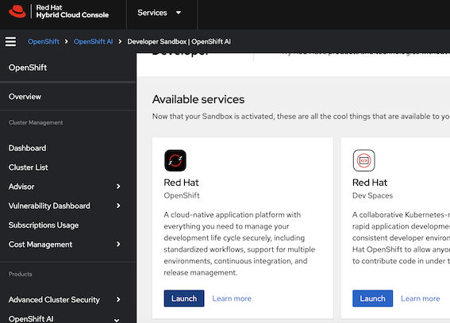
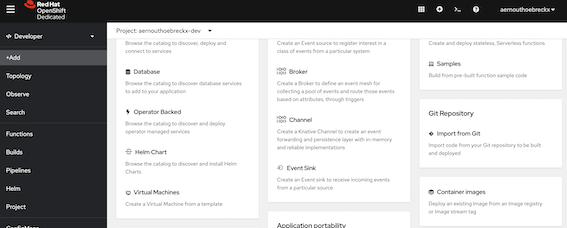
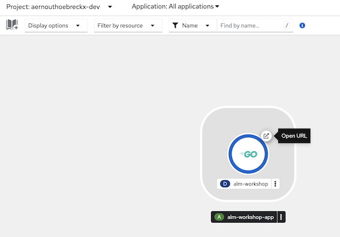
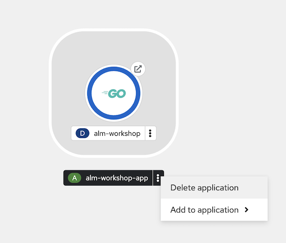
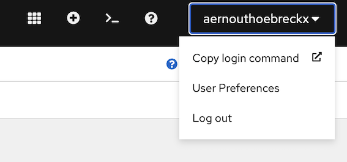

# Introduction

Hi everybody! Welcome to the ALM Workshop of 2024!

We give this workshop with a few goals in mind:
* Learn new (or unfamiliar) technologies
* Implement CI ALM concepts
  * You learned the theory, now it's time to implement

While it's easier to work with technologies that you use day-to-day, today I would like to try some technologies that you (probably) haven't really worked with yet:

* Golang
* Quay
* GitHub DevSpaces / DevContainers
* GitHub Actions
* RedHat OpenShift

# Workshop

The workshop will be divided in several tasks that each represent a checkpoint.
If one of the tasks is not working or you ran out of time you can always check-out the branch for that specific checkpoint and catch-up from there.

# Tasks

## Configuration repository
The configuration repository is called **alm-workshop-2024-cfg**. You've been provided with basic Kubernetes manifests to deploy on an Openshift cluster in the cloud. The industry standard way of doing this is by using Helm charts or Kustomize but these are a bit more complex so as such we're using the most basic setup.

One thing to note is that this repository starts from the **"dev"** branch as primary branch. We will create more branches per environment later on in the exercise, but we use this model in practice often to easily compare configuration changes between environments using Git Diffs & granular approvals per pull-request so that the right people approve for the right environments.

## Devcontainer

There is another devcontainer available for you to use that has OpenShift CLI / Helm installed for you to use. Create the codespace for this repository like you did in the previous.

## Task 1

:exclamation: **This task needs to be completed in the alm-workshop-2024-src code repository**

## Task 2

:exclamation: **This task needs to be completed in the alm-workshop-2024-src code repository**

## Task 3

* ***Fork** the base repository to your own account!*
* Login to RedHat Openshift Sandbox https://console.redhat.com/openshift/sandbox
  * Press "Getting started"
  * You should be able to launch OpenShift
    
* Deploy your application from the Developer menu by selecting Add+
  * If you scroll down a bit you should see "Container Images" as option
    
  * You should use your quay.io image registry URL now to deploy your application
    * Deployment Type = Deployment
    * Icon = Golang
    * Rest should be OK by default
* Your application should now be available from a remote endpoint
  * You should be transferred to the Topology view and your application should have a little arrow icon you can click to open the route.
  

This was a lot of manual effort, imagine doing this for each release! We want to automate this flow to reduce the effort to deploy but mostly to have a consistent way of doing this. Right now the process is quite error-prone.

## Task 4

We will start using IaC to make this process a bit more consistent. Kubernetes as discussed is basically one big API service that uses YAML files as interfaces to create resources. These resources are then interpreted by Kubernetes and the right actions are taken to make sure that your application is deployed as a container, has connectivity, is available from outside (ingress), ...

* Let's undeploy our previous application version first by selecting the Application in the "Topology View" and select "Delete application"
  
* Read the openshift.yaml to understand the Kubernetes resources and what they do
* Edit the Kubernetes openshift.yaml to use your Docker image
  * There's some other fields that you should also fill-in or check!
* Login to the cluster from a CLI by copying the "Login Command"
  
  * You should now be able to do `oc get pods` & get to see your pods that are running
    * `oc get deployments` will show you the deployment resource that OpenShift created for us in the previous step
    * `oc get svc` will show the services
    * `oc get routes` will show the routes & the urls from which you can connect
  * You can apply the openshift.yaml using the command `oc apply -f openshift.yaml`
  * Use `oc get pods` to see that your new pods are running
    * Use the previous commands to see the new resources that we just created.
* Create a new pipeline in this repository that automatically applies the openshift.yaml
  * Provide the correct secrets to login to the Openshift cluster from your repository.
  * Make sure that this pipeline only runs from the dev branch
  * The token that we used before is only valid for 24 hours, so we usually don't use this for automation but it's OK for this task (we will work on this later).
* Make a change in the openshift.yaml (update the replicas) and let the pipeline apply the changes
  * Validate the changes via the UI or via the CLI

We now have an automated pipeline to deploy our application to DEV! In the next task we will update our application code and get ready this change through the SDLC.

## Task 5

:exclamation: **This task needs to be completed in the alm-workshop-2024-src code repository**

## Task 6

In this task we will deploy a new environment!

* Create a new branch from "dev" called "tst"
* Update "tst" branch to give different names to the Deployment, Service and Route resource
  * Update the pipeline file to run on tst branch
  * Use tst- instead of dev- if we don't update this we will have conflicts.
    * Normally we would use "Namespaces" to avoid naming conflicts, but the OpenShift Sandbox does not allow us to create multiple namespaces due to security risks
* The "tst" branch should always deploy a released version, you can deploy version 1.0.0 first and then afterwards update to 1.1.0

## Finish?

**Congratulations, you've now got a functioning code pipeline!! You can update, release and expose you're application on demand now** :clap::muscle:
The next step is to now improve upon this, so that you as a developer can focus solely on producing the code. Choose some of the extra tasks to do, in both repositories are different tasks related to their type.

## Extra's
* Convert to Helm Chart instead of kubectl apply deploy method
  * [Helm charts](https://helm.sh/) are the most popular way of managing Kubernetes resources, because you can use advanced templating features
  * As inspiration an older repository https://github.com/arnouthoebreckx/tafun-alm-workshop-cfg
    * This was made for a quarkus-application but conceptually this can be almost fully reused for Golang
    * Don't read the README it was a different exercise back then
* Add a Horizontal Pod Autoscaler that based on amount of load (requests) to the service will automatically spin up extra pods
  * Simulate a load with Postman or just a bash while loop with curl.
* Add readinessProbes to your Deployment
  * They are used to check that the application is functionally ready to receive connections
* Deploy a Redis Helm-chart as a dependency and change the application to store a key into this Redis
  * The deployment part should be pretty easy if you've set up your Helm Chart correctly the code changes are a bit more work